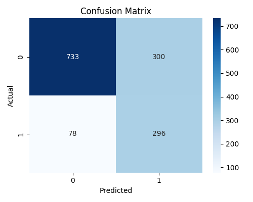
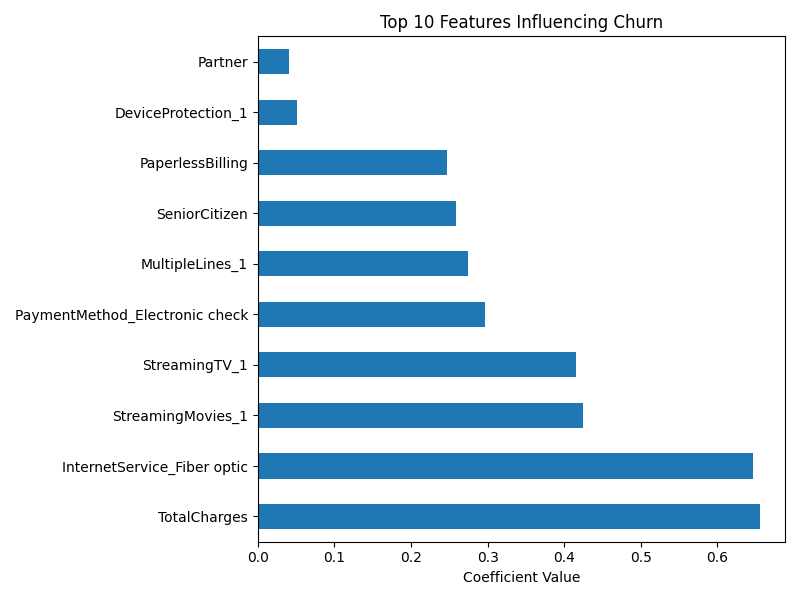

# 📊 Customer Churn Prediction – Logistic Regression (Python)

This project predicts customer churn using the Telco dataset.  
It includes data cleaning, feature engineering, logistic regression modeling, and model evaluation with visual outputs.

---

## 🧠 Problem Statement

Telecom companies struggle with customer retention. This project builds a logistic regression model to predict whether a customer will churn based on account and service features.

---

## 🔧 Tools Used

- Python 3
- pandas, NumPy
- scikit-learn
- matplotlib, seaborn

---

## 🚀 Key Steps

- Cleaned and preprocessed 20+ features
- Converted categorical values and handled missing data
- Scaled numeric variables (`MonthlyCharges`, `TotalCharges`, `tenure`)
- Handled class imbalance using `class_weight='balanced'`
- Trained and evaluated a logistic regression model

---

## 📈 Model Evaluation

- **Accuracy:** ~78.7%
- **Precision (Churn):** 62%
- **Recall (Churn):** 52%
- **F1-Score (Churn):** 56%

---

## 📷 Visualizations

### Confusion Matrix  

### Feature Importance  

---

## 📄 Additional Files
- [`churn_prediction.py`](churn_prediction.py): The main Python script for cleaning the data, training a logistic regression model, and generating visual outputs.
-  [`insights-summary.md`](insights-summary.md): Key takeaways, model performance interpretation, and recommendations based on the churn analysis.

---

## 📁 Project Structure
- visuals/
  - confusion_matrix.png
  - feature_importance.png
- churn_prediction.py
- README.md
- insights-summary.md
- telco_churn.csv

---

## 📬 Author

**Sofiia Hrabova**  
[LinkedIn →](https://www.linkedin.com/in/sofiia-hrabova-1380a7338)

---

## 🔗 Back to Portfolio
Want to see more projects?  
👉 [View my full GitHub portfolio here](https://github.com/sofiiahrabova/sofiia-portfolio)

